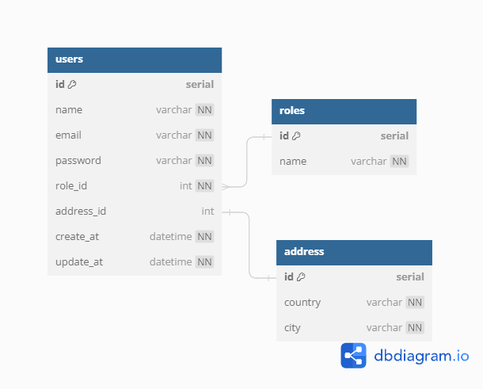
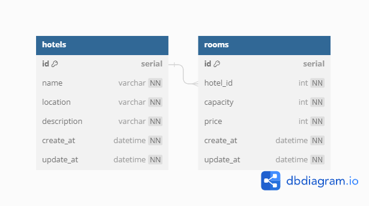
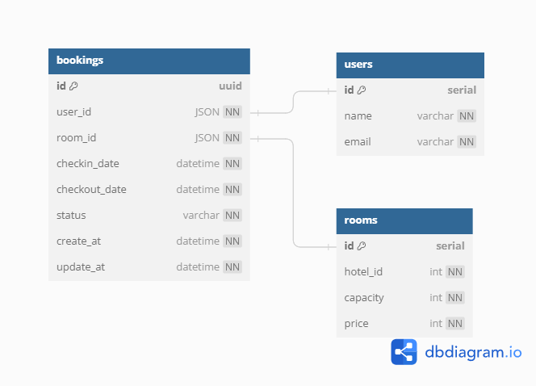
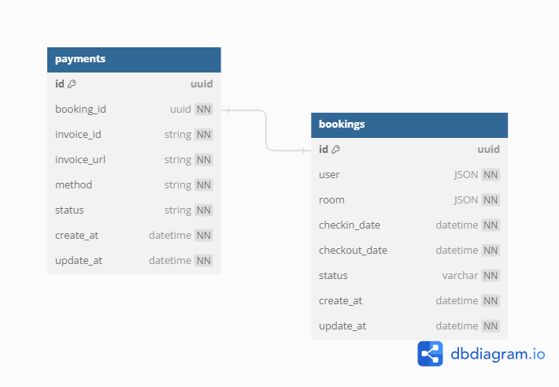

# vihotel

<!--  -->

An e-commerce API for booking hotel and with many features, made using microservices and gRPC.

[API Documentation](https://ms-gateway-3zet57vi3a-et.a.run.app/swagger/index.html)

## Features
- Microservice Architecture
- gRPC-based services
- Serverless Deployment with Google Cloud Run
- Payment gateway integration (Xendit)

## Tech Stack
- Go
- Echo
- GCP
- Microservices
- gRPC
- REST
- PostgreSQL
- MongoDB

#### 3rd Party APIs
- Xendit

## Application Structure
<!--  -->

## Application Flow
<!--  -->

---
<!--  -->

## ERD

### User

### Hotel

### Booking

### Payment

